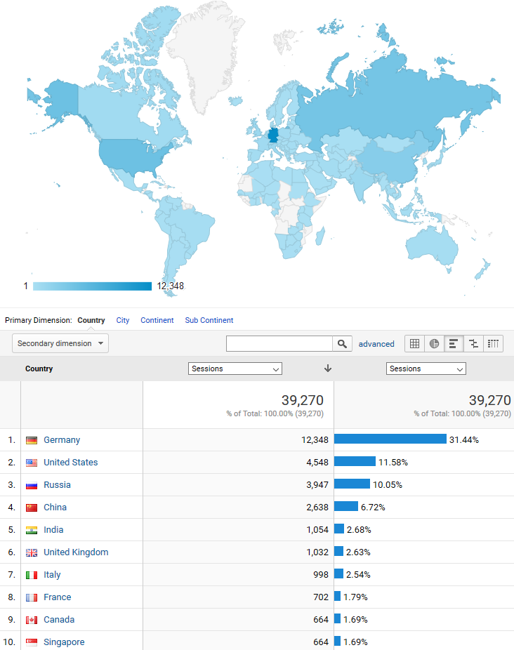

# RGoogleAnalytics
Quantlets for the Section "Google Analytics" in "GitHub API based QuantNet Mining infrastructure in R".

It is part of the following work:

```
@phdthesis{Borke2017Thesis,
    author = {Borke, Lukas},
    title = {Dynamic Clustering and Visualization of Smart Data via D3-3D-LSA},
    school = {Humboldt-Universität zu Berlin, Wirtschaftswissenschaftliche Fakultät},
    year = {2017},
    doi = {http://dx.doi.org/10.18452/18307}
}
```

I greatly appreciate the followong R package:

```
@Manual{RGoogleAnalytics,
    title = {RGoogleAnalytics: R Wrapper for the Google Analytics API},
    author = {Michael Pearmain and Nick Mihailowski and Vignesh Prajapati and Kushan Shah and Nicolas Remy},
    year = {2014},
    note = {R package version 0.1.1},
    url = {https://CRAN.R-project.org/package=RGoogleAnalytics},
}
```



